# Demo 3 开发计划

## 1. 文档定位

本文档是 **Demo 3：Class III（E-R）效用解耦实验** 的中文开发计划。

它的目标不是泛泛地说明 “OOD 会失败”，而是把 Demo 3 的因果边界、
开发顺序、实验留存物、视频采集物、图片清单与验收口径固定下来，
避免后续把它做成：

- reward 设计错误的 `C-R`
- coverage 不足的 `E-C`
- 或一个虽然很难、但解释不清的普通泛化失败案例

对应的总规划来源：

- [cre-demos/README.md](../README.md)

本 Demo 的唯一主张是：

> 在 nominal 训练分布之外，即使 reward 看起来还不错，真实任务效用也可能明显下滑；
> 因此不能把 reward 直接当成 deployment utility。

如果最终现象不能支持这句话，就说明 Demo 3 做偏了。

---

## 2. 实验目标

### 2.1 主目标

证明：

- 主要问题不在 reward 数值本身是否变低
- 主要问题在 environment shift 让 reward proxy 与真实任务效用脱钩
- `W_ER` 应该成为主导 witness

### 2.2 对外展示目标

这个 demo 对外要让观众一眼看懂四件事：

1. nominal 场景里，reward 和任务完成效果基本一致
2. shifted 场景里，reward 依然不算太差，但任务成功率、安全性、通过效率已经明显变差
3. 如果只看 `average_return`，会误判策略“还行”
4. robustness-side repair 后，reward 与 utility 的裂口会缩小

### 2.3 非目标

本 Demo **不**追求：

- 证明 reward 本身写错
- 证明训练从来没见过 critical 几何
- 制造极端到必然崩溃的 OOD 场景
- 同时叠加太多 failure mode

如果这些内容变成主角，这个 demo 就不是 `E-R` 了。

---

## 3. 核心因果假设

### 3.1 因果结构

固定：

- nominal reward 定义与权重
- nominal 训练预算
- policy 结构
- utility 指标定义
- nominal eval seed 集
- shifted eval seed 集

只改变：

- eval 环境分布
- shifted 几何偏移、轻度障碍密度变化、轻度观测/交通扰动
- repair 侧的 robustness 训练策略

希望观察到：

`environment shift 增强 -> average_return 仍保持可观 -> success_rate / min_distance / time_efficiency 下降 -> utility_reward_decoupling 扩大 -> W_ER 上升`

### 3.2 不能接受的混因果

以下情况都算失败或跑偏：

1. shifted 版本其实把 reward 也改了
2. utility 指标偷偷由 reward 推导出来
3. shift 强到策略全面崩溃，reward 和 utility 一起断崖式归零
4. 现象本质上是训练 coverage 不足，而不是 transfer mismatch
5. repair 后只是把 reward 进一步堆高，而不是缩小 reward-utility 裂口

---

## 4. 效用指标冻结

Demo 3 的关键，不是先跑实验，而是先把 **utility metric** 冻结。

### 4.1 建议采用两层指标

第一层：分项任务效用指标

- `success_rate`
- `collision_rate`
- `timeout_rate`
- `min_distance`
- `normalized_time_to_goal`
- `path_efficiency`

第二层：一个不依赖 reward 的聚合效用分数

- 建议命名：
  - `U_task_v1`

### 4.2 建议的 `U_task_v1`

建议先固定为：

```text
U_task_v1 =
  0.40 * success_flag
  - 0.25 * collision_flag
  - 0.15 * timeout_flag
  + 0.10 * clearance_score
  + 0.10 * time_efficiency_score
  + 0.10 * path_efficiency_score
```

其中：

- `success_flag`:
  到达目标记 `1`，否则 `0`
- `collision_flag`:
  碰撞记 `1`
- `timeout_flag`:
  超时 / 卡住记 `1`
- `clearance_score`:
  由 `min_distance` 归一化得到
- `time_efficiency_score`:
  由完成时间相对 nominal 参考时间归一化得到
- `path_efficiency_score`:
  由路径长度或绕行程度归一化得到

### 4.3 冻结规则

必须满足：

1. `U_task_v1` 的公式在 clean / injected / repaired 之间完全一致
2. 任何展示图里都要同时给出 reward 与 utility，不能只给 reward
3. 后续如果改 `U_task_v1`，必须新起版本号，例如：
   - `U_task_v2`

---

## 5. 场景设计方案

### 5.1 场景族命名

建议正式命名：

- Demo 目录：
  - `demo3_er_shifted_gate`
- nominal train / nominal eval：
  - `demo3_er_nominal_gate`
- shifted eval：
  - `demo3_er_shifted_gate_crossing`

### 5.2 nominal 场景外观

nominal 场景建议具有：

- 居中的门洞 / 窄口
- 相对规则的障碍间距
- 可预期的通过姿态
- 对策略来说是“看起来正常”的训练和评估几何

目标：

- 让 reward 与 utility 在 nominal 中大体一致

### 5.3 shifted 场景外观

shifted 场景建议只做 **轻中度偏移**，例如：

- 门洞横向平移
- 通过窗位置略偏
- 一侧障碍间距略收窄
- 加入轻度 cross-traffic 障碍
- 轻度传感器偏置 / 感知噪声

目标：

- 不是把任务变成不可能
- 而是让策略“还能拿到一些 reward”，但真实效用已明显下降

### 5.4 推荐视觉概念

推荐采用：

- “中门穿越”布局
- nominal 中门洞居中、路径较顺
- shifted 中门洞侧移并叠加轻度扰动

这样做的好处是：

1. nominal 与 shifted 的几何差异很容易画出来
2. 同 seed 对比视频更容易出片
3. 轨迹偏移、擦边、犹豫、超时都能明显看见

### 5.5 可视化要求

该 demo 至少要能从图上直接看出：

1. nominal 和 shifted 到底哪里不一样
2. 为什么 shifted 仍可能给出“前进得还行”的 reward
3. 为什么真实通过效果已经下降
4. repair 后哪些行为恢复了

如果看图看不出 “reward 还可以，但 utility 已经不行”，
这个场景设计应该重做。

---

## 6. 版本划分

Demo 3 固定做三个版本，但它和 Demo 1 / 2 的三版本含义不同。

### 6.1 Clean

目标：

- 作为 reward 与 utility 对齐的 nominal 对照组

定义：

- nominal train
- nominal eval

要求：

- reward 与 `U_task_v1` 方向基本一致
- 成功率、安全性、时间效率都处于可接受范围

### 6.2 Injected

目标：

- 制造明确的 `E-R` 解耦问题

定义：

- 仍使用 nominal train 的 policy
- 在 shifted eval 上运行

要求：

- reward 不改
- policy 不改
- 只改 eval 环境

预期现象：

- `average_return` 下降不算太大
- `success_rate` 明显下降
- `timeout_rate` 或 `collision_rate` 上升
- `min_distance` 变差
- `W_ER` 成为主方向

### 6.3 Repaired

目标：

- 证明 robustness-side repair 能缩小 reward-utility 裂口

定义：

- nominal train 基础上加入 robustness repair
- 在同一 shifted eval 上运行

建议修复方式：

- domain randomization
- shifted family 注入
- mild sensor bias augmentation
- gate offset curriculum

预期现象：

- shifted 下 `U_task_v1` 回升
- `success_rate` 恢复
- `timeout_rate` / `collision_rate` 回落
- reward 不一定大涨，但 reward 与 utility 的偏差缩小

---

## 7. 开发计划

建议按 8 个阶段推进，不要跳步。

### 阶段 A：效用指标冻结

目标：

- 在任何实验前先冻结 `U_task_v1`

要完成的事情：

1. 定义 episode 级 utility 字段
2. 定义 run 级聚合口径
3. 明确 success / collision / timeout 的判定规则
4. 明确 normalization 参考值

交付物：

- 本文档
- `utility_metric_spec.md` 或等价字段说明

### 阶段 B：场景草图与 shift 机制冻结

目标：

- 让 nominal / shifted 的差异既足够明显，又不过度夸张

要完成的事情：

1. 画 nominal 场景草图
2. 画 shifted 场景草图
3. 明确 shift 参数：
   - 门洞偏移量
   - 障碍收窄量
   - cross-traffic 开关
   - 观测偏置量
4. 明确固定 seed 列表

验收标准：

- 同一张结构图里能清楚看出 nominal vs shifted
- 仅从示意图就能解释实验逻辑

### 阶段 C：配置与数据契约实现

目标：

- 先把 demo3 的 machine-readable contract 定下来

要完成的事情：

1. nominal / shifted 场景配置
2. clean / repaired 训练配置
3. utility 汇总 JSON schema
4. 可视化 manifest 结构

验收标准：

- 输出目录结构固定
- 指标命名固定
- 同一字段可被图表、验证和最终摘要共同消费

### 阶段 D：最小可运行轨迹回放

目标：

- 先产出同 seed 的 nominal / shifted 对比回放

要完成的事情：

1. 导出 nominal 成功回放
2. 导出 shifted 擦边 / 犹豫 / 超时回放
3. 导出同 seed 对比叠图

验收标准：

- 不看代码也能看懂 shift 造成了什么行为变化

### 阶段 E：指标验证

目标：

- 验证 reward 与 utility 真的出现了裂口

要完成的事情：

1. 统计 `average_return`
2. 统计 `U_task_v1`
3. 统计 `success_rate`
4. 统计 `collision_rate`
5. 统计 `timeout_rate`
6. 统计 `min_distance`
7. 统计 `W_ER`

验收标准：

- injected 出现“reward 还行，但 utility 掉点”的定量证据

### 阶段 F：repair 设计与回放

目标：

- 找到一个不会破坏 nominal 表现、又能缩小 shifted 裂口的 repair

要完成的事情：

1. 注入 robustness-side train augmentation
2. 重新导出 shifted eval 结果
3. 对比 injected vs repaired 的 utility 恢复情况

验收标准：

- repaired 的主效果是缩小 decoupling，而不是把 reward 硬堆高

### 阶段 G：出图与出视频

目标：

- 形成一套可直接上 deck / README / HTML 的展示资产

要完成的事情：

1. 导出 8~10 张图
2. 导出 4~6 条视频或 HTML replay
3. 准备 summary card
4. 准备 visual manifest

验收标准：

- 图和视频之间叙事顺序一致
- 每张图都能服务于“reward 不等于 utility”这个主张

### 阶段 H：最终验证与打包

目标：

- 做到可复现、可回放、可解释

要完成的事情：

1. 生成 verification summary
2. 汇总 clean / injected / repaired 三联结果
3. 输出 takeaway markdown
4. 固化 seed manifest、config snapshot、visual manifest

验收标准：

- 能一次性回答“改了什么、固定了什么、为什么算 E-R、修复是否有效”

---

## 8. 必保存实验数据清单

Demo 3 必须坚持 **证据优先**，不能只留最终图片。

### 8.1 配置快照

必须保存：

- `cfg/spec_shared/reward_spec_v0.yaml`
- `cfg/spec_shared/constraint_spec_v0.yaml`
- `cfg/spec_shared/policy_spec_v0.yaml`
- `cfg/env_nominal/*.yaml`
- `cfg/env_shifted/*.yaml`
- `cfg/env_repaired/*.yaml`

额外要求：

- 保存 config snapshot manifest
- 明确每个输出对应的 config 版本

### 8.2 场景与 seed 留存

必须保存：

- `seed_manifest.json`
- `scene_instance_manifest.json`
- `scene_catalog.jsonl`
- nominal / shifted 对应的 `scene_summary.md`

建议补充：

- 每个 seed 对应的门洞偏移量
- 每个 seed 对应的障碍布局摘要
- 每个 seed 对应的 shift 类型标签

### 8.3 原始运行证据

必须保存：

- `steps.jsonl`
- `episodes.jsonl`
- `episodes/episode_*.json`
- `trajectory_records.json`
- `acceptance.json`
- `summary.json`
- `manifest.json`

clean / injected / repaired 三组都要留。

### 8.4 聚合指标

必须保存：

- `metrics_summary.json`
- `utility_summary.json`
- `reward_vs_utility_points.csv`
- `episode_failure_breakdown.json`
- `nominal_vs_shifted_gap.json`

其中至少要有这些字段：

- `average_return`
- `U_task_v1_mean`
- `success_rate`
- `collision_rate`
- `timeout_rate`
- `min_distance_mean`
- `normalized_time_to_goal_mean`
- `path_efficiency_mean`
- `W_ER`

### 8.5 分析与验证证据

必须保存：

- `analysis/static/...`
- `analysis/dynamic/...`
- `analysis/semantic/...`
- `analysis/report/...`
- `analysis/repair/...`
- `analysis/validation/...`
- `verification/verification_summary.json`
- `verification/verification_summary.md`

特别建议在验证汇总里单独保留：

- `reward_stays_decent_under_shift`
- `utility_drops_under_shift`
- `injected_elevates_W_ER`
- `repair_reduces_reward_utility_decoupling`

### 8.6 绘图源数据

必须保存：

- 画柱状图用的 CSV
- 画散点图用的 CSV
- 画热图用的栅格或坐标 JSON
- 画 summary card 用的单文件 JSON

原因：

- 后续换图风格时，不用重新跑实验

---

## 9. 必拍视频清单

这个 demo 至少要准备下面 5 条视频或回放。

### 9.1 必做视频

1. nominal 成功回放
2. shifted 同 seed 对比回放
3. injected shifted 近失败 / 超时回放
4. repaired shifted 恢复回放
5. clean / injected / repaired 三联 split-screen 回放

### 9.2 如果时间允许，再加

1. shift 强度从弱到强的渐变视频
2. reward 与 utility 叠字版解释视频
3. same-seed top-down overlay 动画

### 9.3 每类视频建议保存两个版本

每条视频建议保留：

1. 原始版本
   - 分辨率高
   - 不压字幕

2. 展示版本
   - 有标题
   - 有 seed
   - 有 nominal / shifted 标签
   - 有 reward / utility / result 标签

建议文件命名：

- `demo3_nominal_success_raw.html`
- `demo3_nominal_success_captioned.html`
- `demo3_shifted_same_seed_raw.html`
- `demo3_shifted_same_seed_captioned.html`
- `demo3_injected_shifted_failure_raw.html`
- `demo3_injected_shifted_failure_captioned.html`
- `demo3_repaired_shifted_recovery_raw.html`
- `demo3_repaired_shifted_recovery_captioned.html`
- `demo3_triplet_split_screen_raw.mp4`
- `demo3_triplet_split_screen_captioned.mp4`

### 9.4 视频拍摄重点

录视频时必须保证能看出来：

1. UAV 位置与姿态
2. 起点和目标点
3. nominal / shifted family 标签
4. 门洞或关键偏移结构
5. 最终结果是 success / collision / timeout / stuck 哪一种

建议额外叠加：

- seed 编号
- scene id
- 当前 `average_return`
- 当前 `U_task_v1`
- `min_distance`
- failure tag

---

## 10. 必做图表清单

这个 demo 至少要产出下面 8 张图。

### 图 1：nominal vs shifted 场景结构图

内容：

- 同一任务语义下的两类典型几何
- 标出门洞偏移、障碍收窄、cross-traffic 位置

### 图 2：同 seed 轨迹对比图

内容：

- 同一个 seed 下 nominal 与 shifted 的 top-down overlay
- 标出“ nominal 通过 / shifted 犹豫或擦边 ”

### 图 3：reward vs utility 散点图

内容：

- x 轴：`average_return` 或 episode return
- y 轴：`U_task_v1`
- clean / injected / repaired 用不同颜色

这是 Demo 3 最核心的一张图。

### 图 4：reward 与 utility 分组柱状图

指标：

- `average_return`
- `U_task_v1_mean`
- clean / injected / repaired 三组对比

目标：

- 一眼看出 injected 的 reward 掉得不多，但 utility 掉得更狠

### 图 5：成功率 / 超时率 / 碰撞率对比图

指标：

- `success_rate`
- `timeout_rate`
- `collision_rate`

目标：

- 说明 utility 下降具体体现在哪些 failure mode 上

### 图 6：min-distance 与 path-efficiency 对比图

指标：

- `min_distance_mean`
- `path_efficiency_mean`
- `normalized_time_to_goal_mean`

目标：

- 说明不是只有“到没到达”，而是通过质量也变差了

### 图 7：repair 恢复图

指标：

- injected vs repaired
- 显示：
  - `W_ER` 回落
  - `U_task_v1` 回升
  - success gap 缩小

### 图 8：一页 summary card

内容：

- 左边一张 nominal 图
- 中间一张 shifted 图
- 右边三组关键数字
- 底部一句中文结论和一句英文结论

---

## 11. 推荐加拍的“好看且有代表性”图片

为了后续做 deck、README 和网页展示，建议在必做图之外，再准备下面 6 类图片。

### 11.1 门洞偏移放大图

要求：

- 在整体场景图上加一个 inset 小窗
- 放大显示 nominal 门洞中心线与 shifted 门洞中心线

作用：

- 这张图非常适合做“环境真的只变了一点，但行为已经变差”的视觉证据

### 11.2 同轨迹多帧拼图

要求：

- 选一个代表性 seed
- 把接近门洞前、中、后的 3 到 5 帧拼在一张图里

作用：

- 可以直观看到：
  - nominal 更顺
  - shifted 更犹豫、更擦边、或更绕

### 11.3 轨迹密度热图

要求：

- 单独画 shifted 的失败热点
- 再叠一层 repaired 的恢复轨迹

作用：

- 很适合说明 repair 不是玄学，而是把行为重新拉回可通过区域

### 11.4 reward-utility 象限图

要求：

- 把 episode 点分成四个象限：
  - 高 reward / 高 utility
  - 高 reward / 低 utility
  - 低 reward / 高 utility
  - 低 reward / 低 utility

作用：

- 这张图能最直接证明 Demo 3 的核心命题

### 11.5 failure montage

要求：

- 一张图上并排放：
  - timeout
  - boundary grazing
  - stuck oscillation

作用：

- 能让观众理解 utility 下降不是抽象数字，而是具体失效模式

### 11.6 repair before/after 对照海报

要求：

- 左侧 injected，右侧 repaired
- 中间只保留 3 个最重要指标

作用：

- 非常适合做组会首页或报告封面图

---

## 12. 图像出片规范

如果想让图既“好看”又“能证明有效性”，建议统一下面的风格规范。

### 12.1 统一视觉元素

所有图建议固定：

- nominal：蓝色系
- shifted / injected：橙红色系
- repaired：绿色系
- danger / shift 区：半透明红色高亮

### 12.2 统一标注元素

每张关键图至少包含：

- 起点 `S`
- 终点 `G`
- gate / narrow passage 标识
- seed 或 scene id
- 图例

### 12.3 统一版式

建议：

- 左图放几何
- 右图放指标
- 下方放一句 takeaway

这样后续转成 HTML deck 时最省事。

### 12.4 统一拍摄视角

必须保证：

- nominal / shifted 用同一俯视尺度
- inset 放大框大小一致
- split-screen 的时间进度对齐

如果视角不一致，视觉比较会变弱。

---

## 13. 最终交付建议

Demo 3 最终建议交付成以下内容。

### 13.1 面向内部研发

- 完整实验目录
- 原始日志
- utility 汇总 JSON / CSV
- 原始截图
- 原始视频 / replay
- repair 前后对比结果

### 13.2 面向组会 / 汇报

- 1 页实验摘要 markdown
- 6~8 张图
- 1 个 split-screen 对比视频
- 1 张 reward-vs-utility 核心散点图

### 13.3 面向后续 HTML deck

至少准备：

1. 一张 nominal vs shifted 结构图
2. 一张 reward vs utility 散点图
3. 一张关键指标柱状图
4. 一条 same-seed 对比视频
5. 一句中文结论
6. 一句英文结论

---

## 14. 验收标准

Demo 3 只有同时满足以下条件，才算完成。

### 14.1 因果验收

1. reward 定义完全冻结
2. utility 定义完全冻结
3. injected 只改 eval environment
4. repaired 只做 robustness-side repair
5. shift 不是极端到不可恢复的破坏性变更

### 14.2 现象验收

1. shifted `average_return` 仍保持 non-trivial
2. shifted `U_task_v1` 明显下降
3. shifted `success_rate` 明显下降，或 `timeout_rate` / `collision_rate` 明显上升
4. `W_ER` 是主方向
5. repaired 能明显缩小 reward-utility decoupling

建议量化目标：

- shifted `average_return` 至少保留 nominal 的 `80%`
- shifted `success_rate` 至少下降 `30 pp`
- 或 shifted `timeout_rate` 上升至少 `20 pp`
- repaired 至少收回一半 injected 的 utility 损失

### 14.3 展示验收

1. 有 nominal vs shifted 结构图
2. 有 reward vs utility 散点图
3. 有关键指标柱状图
4. 有 same-seed 对比视频
5. 不看代码也能看懂 “reward 不等于 utility”

---

## 15. 一页防跑偏清单

开始实现前，先逐条检查。

### 必须满足

- reward 固定
- utility 固定
- shift 才是唯一主变量
- injected 的 reward 不能完全塌掉
- 有 reward 与 utility 的同时展示
- repair 目标是缩小 decoupling

### 一旦出现就暂停

- reward 也改了
- utility 是从 reward 直接算出来的
- shifted 场景过难，所有 episode 一起崩
- 主要现象变成 coverage 不足
- 只有结果图，没有原始 machine-readable 证据

---

## 16. 下一步建议

按下面顺序做最稳：

1. 先冻结 `U_task_v1`
2. 再冻结 nominal / shifted 场景草图
3. 先做 same-seed nominal vs shifted 回放
4. 现象成立后再补 repair
5. 最后再补齐所有图片、视频、summary card

如果第一轮实验里 shifted reward 跟 utility 一起掉光，
不要急着加大 shift，先回到场景设计，把 shift 调回“轻中度但可解释”。

---

## 17. 当前实现状态

Demo 3 已经建立了**独立可重跑的隔离 pipeline**，并完成了 `clean / injected / repaired` 三版本闭环。

当前已经落地的核心文件：

- `cre-demos/demo3_er_shifted_gate/cfg/`
- `cre-demos/demo3_er_shifted_gate/scripts/run_demo3.py`
- `cre-demos/demo3_er_shifted_gate/test_demo3_pipeline.py`
- `cre-demos/demo3_er_shifted_gate/reports/latest/`
- `cre-demos/demo3_er_shifted_gate/assets/screenshots/`
- `cre-demos/demo3_er_shifted_gate/assets/videos/`

### 17.1 一次运行命令

```bash
python3 cre-demos/demo3_er_shifted_gate/scripts/run_demo3.py --clean-output
```

### 17.2 关键结果

- `goal_achieved`: `True`
- `report primary claim`: `E-R`
- `repair operator`: `increase_shifted_boundary_bias`
- `clean decoupling gap`: `-0.064`
- `injected W_ER`: `0.574`
- `injected reward retention`: `0.932`
- `injected utility retention`: `0.244`
- `injected success gap`: `0.667`
- `repaired decoupling gap`: `0.182`
- `repaired shifted success`: `0.833`

### 17.3 证明性图片总览

下面这些图片都已经自动生成，并且每张都有单独的“证明点”：

- `demo3_scene_compare.svg`
- `demo3_gate_offset_inset.svg`
- `demo3_same_seed_overlay.svg`
- `demo3_reward_utility_scatter.svg`
- `demo3_reward_utility_bars.svg`
- `demo3_failure_breakdown.svg`
- `demo3_quality_metrics.svg`
- `demo3_repair_recovery_board.svg`
- `demo3_summary_card.svg`
- `demo3_multiframe_story.svg`
- `demo3_shifted_heatmap.svg`
- `demo3_reward_utility_quadrants.svg`

#### 场景与几何

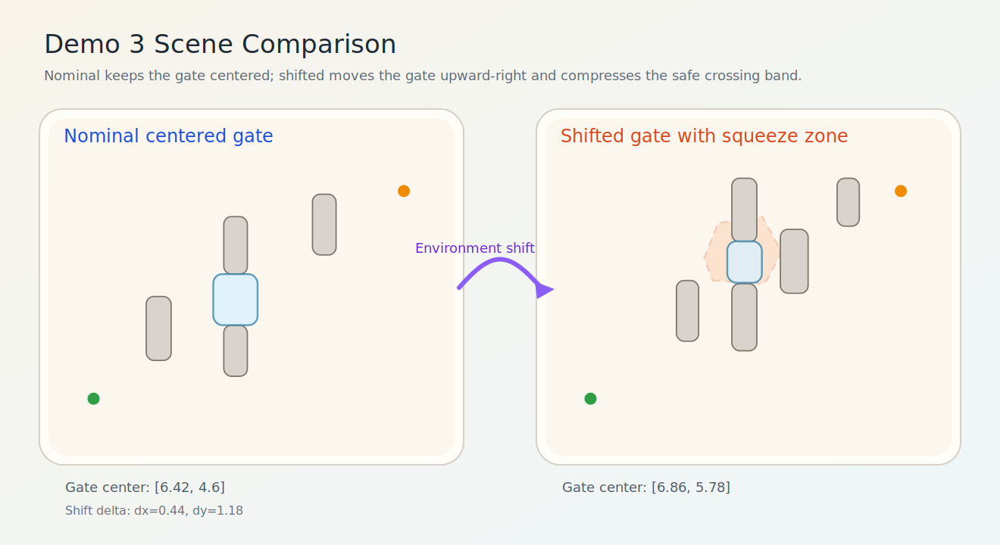

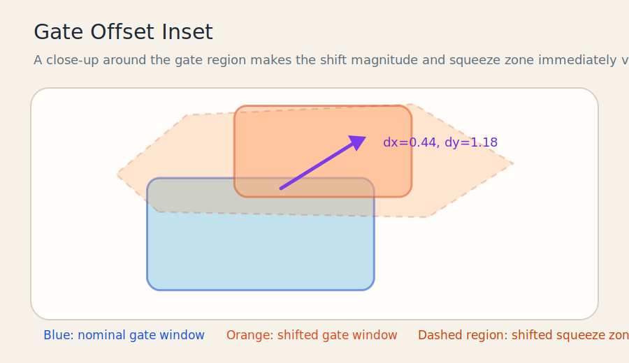

#### 同 seed 行为差异

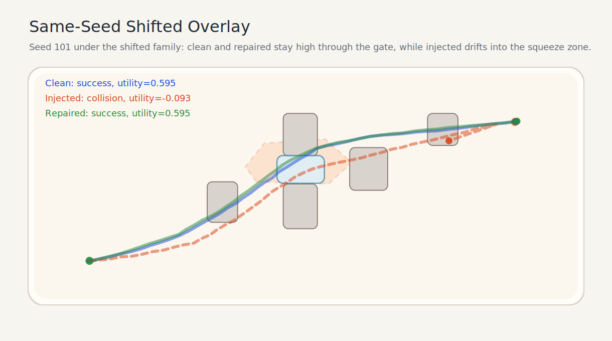

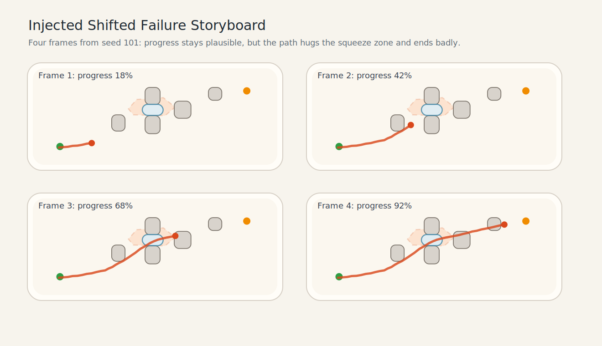

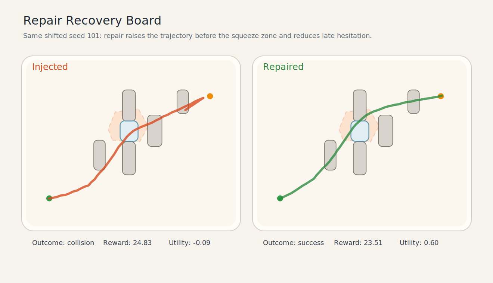

#### Reward / Utility 解耦证据

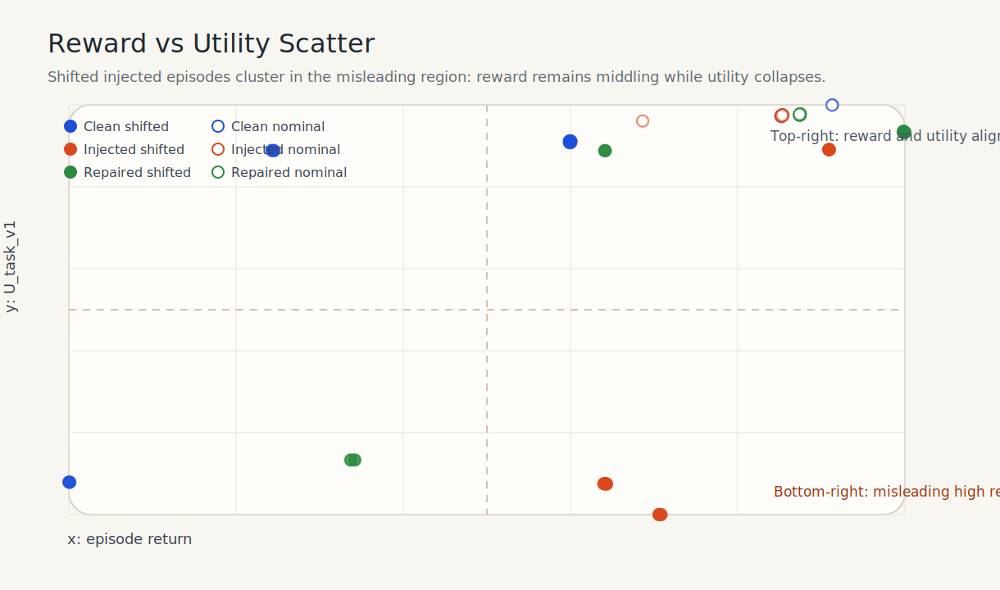

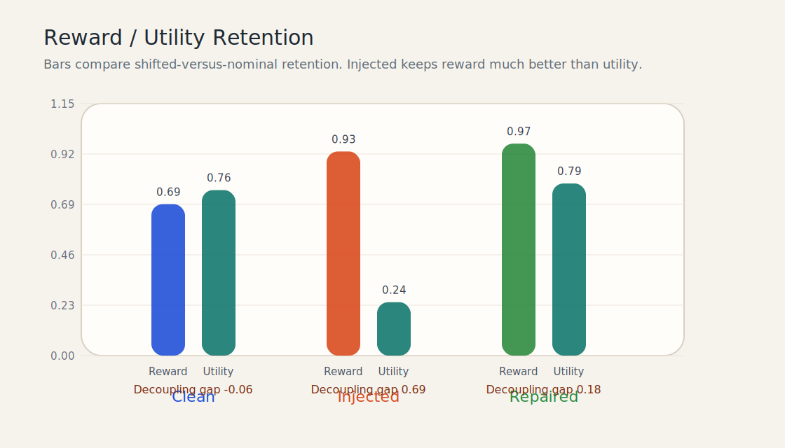

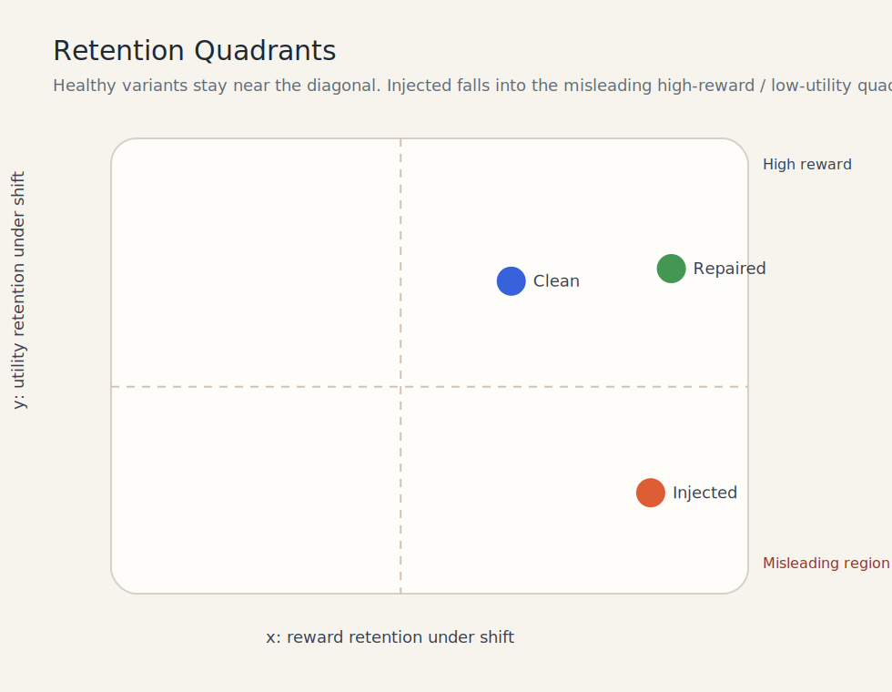

#### 质量与风险

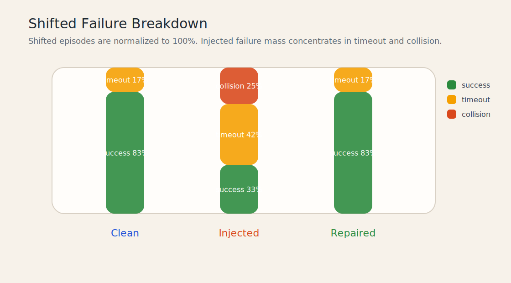

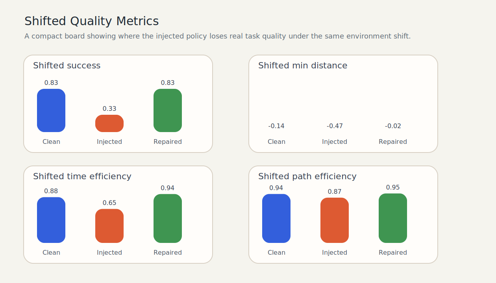

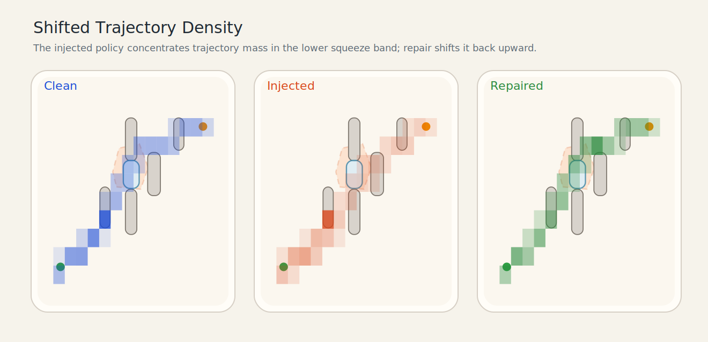

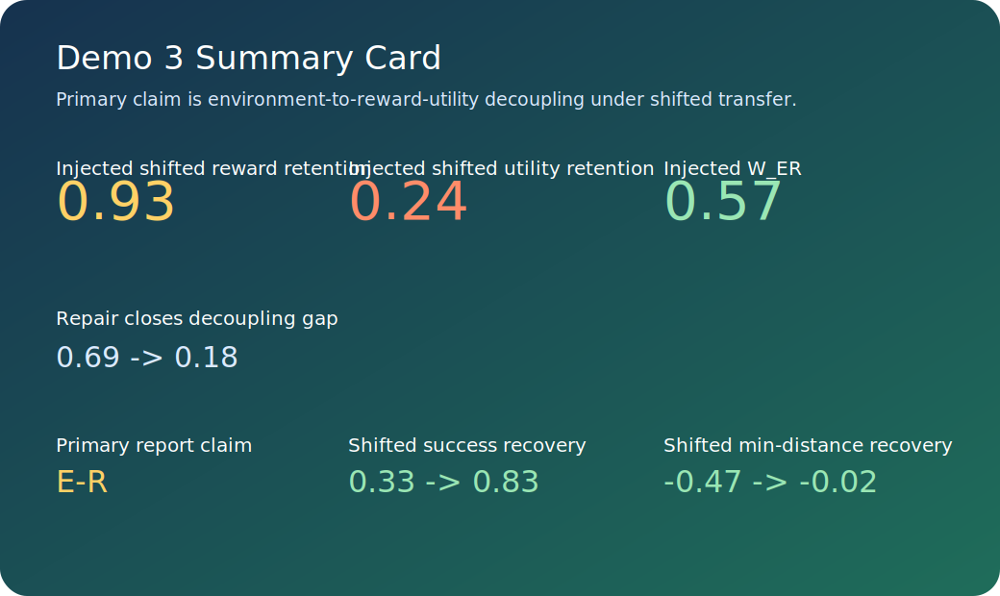

### 17.4 视频 / 回放页面

- [demo3_nominal_success.html](assets/videos/demo3_nominal_success.html)
- [demo3_shifted_same_seed.html](assets/videos/demo3_shifted_same_seed.html)
- [demo3_injected_shifted_failure.html](assets/videos/demo3_injected_shifted_failure.html)
- [demo3_repaired_shifted_recovery.html](assets/videos/demo3_repaired_shifted_recovery.html)
- [demo3_triplet_split_screen.html](assets/videos/demo3_triplet_split_screen.html)

### 17.5 主要留存数据

- `reports/latest/metrics_summary.json`
- `reports/latest/verification/verification_summary.json`
- `reports/latest/verification/reward_diff.md`
- `reports/latest/verification/utility_metric_spec.md`
- `reports/latest/verification/shift_diff.md`
- `reports/latest/injected/analysis/report/demo3_injected_report/report.json`
- `reports/latest/injected/analysis/repair/demo3_injected_repair/repair_plan.json`
- `reports/latest/analysis/validation/demo3_validation/validation_decision.json`
- `assets/screenshots/demo3_summary_metrics.csv`
- `assets/screenshots/demo3_reward_utility_points.csv`

### 17.6 当前结论

这版 Demo 3 已经满足最初计划里的主叙事：

- reward 保持冻结
- utility 保持冻结
- injected 在 shifted 下仍保留一定 reward，但 `U_task_v1`、成功率和安全裕度明显下降
- `W_ER` 成为主 witness
- repair 后 reward-utility 裂口收窄
