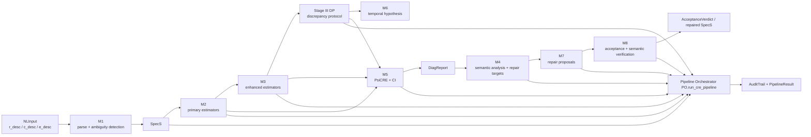

# CRE_v4 与当前项目结构差异对比

Updated: 2026-04-10

## 1. 对比对象与方法

本文比较两个对象：

- 当前仓库实际结构，重点观察仓库根目录与 `isaac-training/training/`
- `doc/CRE_v4.pdf`

本次比对使用的最新文档是：

- `doc/CRE_v4.pdf`
- PDF 元数据创建时间：`2026-04-10 15:38:33 CST`
- 文档版本页标注：`Version 1.0 | April 10, 2026`

对比方法如下：

1. 提取 `CRE_v4.pdf` Part II 的 `Module Registry and Pipeline Topology`、`Core Data Schemas`、`Pipeline Orchestrator`、`Integration Test Suite`
2. 对照仓库中的 `doc/roadmap.md`、`doc/system_architecture_and _control_flow.md`、`doc/verification_readme.md`、`doc/file_structure.md`
3. 再对真实代码树和关键模块做核对，而不是只看现有文档
4. 按四个维度判断差异：
   - 控制流拓扑
   - 模块切分方式
   - 数据与证据契约
   - 产物命名空间与发布边界

状态判断规则：

- `已对齐`：仓库已有明确对应实现
- `部分对齐`：仓库有近似实现，但接口或边界与 `CRE_v4` 不一致
- `未对齐`：`CRE_v4` 明确要求，但仓库当前没有对应结构
- `超出 CRE_v4`：仓库已有实现，但 `CRE_v4` 没有把它作为主结构的一部分

## 2. 结论摘要

当前项目已经具备一个可运行的 CRE 工程栈，但它与 `CRE_v4.pdf` 的结构组织方式并不完全相同。

最核心的判断是：

- 当前仓库是一个 `YAML 规格 + 分阶段脚本 + namespaced bundle` 的工程化实现
- `CRE_v4.pdf` 是一个 `8 个模块 + 1 个统一 orchestrator + 强类型记录对象` 的规范化理论/开发双重框架

因此，两者不是“有没有实现”的差异，而是“实现的组织方式和控制方式”的差异。

当前仓库相对 `CRE_v4` 的强项：

- 已经把 `integration / benchmark / release` 扩到主线结构里
- 已经把运行证据组织成 `analysis/*` namespaced bundles
- 已经把 `mock/offline semantic path` 作为默认可验证路径

当前仓库相对 `CRE_v4` 的主要缺口：

- 没有一个真正落地的统一 `PO.run_cre_pipeline`
- 没有共享的 `AuditTrail` 结构
- 没有显式的 `Stage III Discrepancy Protocol + M6`
- 没有 `PsiCRE + ci_95` 这种统一复合评分中心对象
- 没有把整个系统统一到 `NLInput -> SpecS -> DiagReport -> RepairProposal -> AcceptanceVerdict` 这一套强类型主干上

## 3. `bundle-first` 是什么意思

这里说当前仓库更偏 `bundle-first`，意思不是“先写 bundle 文件”，而是：

- 系统把每个阶段的**机器可读产物包**当成主接口
- 阶段之间主要通过**目录 + JSON/YAML/Markdown 产物**衔接
- “某个阶段是否完成”更多是看它是否写出了约定好的 bundle，而不是只看某个 Python 对象是否在内存里传下去了

在当前项目里，一个 bundle 通常表现为：

- `analysis/<mode>/<bundle_name>/`
- 或者 `training/logs/<run_name>/`

bundle 里通常会有：

- `manifest.json`
- `summary.json`
- 主报告文件
- 下游消费文件
- 可读摘要文件

例如：

- `analysis/static/<bundle>/static_report.json`
- `analysis/report/<bundle>/repair_handoff.json`
- `analysis/repair/<bundle>/validation_context_preview.json`
- `analysis/validation/<bundle>/validation_decision.json`

所以 `bundle-first` 的准确含义是：

- **以落盘后的阶段性证据包作为系统主边界**
- 而不是以“单一 orchestrator 里流动的一组强类型对象”作为唯一主边界

这种方式的优点：

- 更容易复查和回放
- 更适合 smoke test、benchmark、release packaging
- 更方便离线验证与跨脚本衔接

这种方式的代价：

- 容易缺少统一的进程内 pipeline state
- 阶段语义可能分散在多个文件中
- 如果没有额外约束，整体结构会比单 orchestrator 更松散

## 4. 结构流程图

### 4.1 当前 project 流程图

```mermaid
flowchart LR
    A["spec/env config<br/>cfg/spec_cfg + cfg/env_cfg"] --> B["Spec IR<br/>analyzers/spec_ir.py"]
    B --> C["Scene/runtime substrate<br/>env_gen.py + scene_family_bridge.py"]
    C --> D["Execution modes<br/>manual / baseline / eval / train"]
    D --> E["Runtime evidence<br/>training/logs/<run>/"]
    B --> F["Static audit<br/>analysis/static/<bundle>/"]
    E --> G["Dynamic audit<br/>analysis/dynamic/<bundle>/"]
    F --> H["Semantic audit<br/>analysis/semantic/<bundle>/"]
    G --> H
    F --> I["Unified report<br/>analysis/report/<bundle>/"]
    G --> I
    H --> I
    I --> J["Repair generation<br/>analysis/repair/<bundle>/"]
    J --> K["Validation / rerun<br/>analysis/validation/<bundle>/"]
    K --> L["Integration proof<br/>analysis/integration/<bundle>/"]
    L --> M["Benchmark suite<br/>analysis/benchmark/<bundle>/"]
    M --> N["Release packaging<br/>analysis/release/<bundle>/"]
```

当前流程的结构特点：

- 主入口是 YAML 规格与 scene-family 配置
- 各阶段通过 namespaced bundle 连接
- `integration / benchmark / release` 是主线的一部分

### 4.2 `CRE_v4.pdf` 流程图

`CRE_v4` 流程的结构特点：

- 主入口是假定可能来自自然语言的 `NLInput`
- 所有模块由统一 orchestrator 收口
- `SpecS / DiagReport / RepairProposal / AcceptanceVerdict` 是核心中间态
- `AuditTrail` 是全流程公共记录结构

## 5. 顶层结构对比

### 5.1 `CRE_v4` 的结构重心

`CRE_v4.pdf` 的重心是一个统一流水线：

`M1 -> M2 -> M3 -> Stage III DP(M6) -> M5 -> M4 -> M7 -> M8 -> PO`

它更像一个“单系统规范”：

- 入口是自然语言规格 `NLInput`
- 中间核心对象是 `SpecS` 与 `DiagReport`
- 所有模块通过统一 typed schema 交换数据
- 最终由 `Pipeline Orchestrator` 统一编排

### 5.2 当前仓库的结构重心

当前仓库的主线更接近：

`YAML spec/env cfg -> spec_ir -> static/dynamic/semantic scripts -> report -> repair -> validation -> integration -> benchmark -> release`

它更像一个“工程工作区”：

- 入口主要是 `cfg/spec_cfg/*.yaml` 与 `cfg/env_cfg/*.yaml`
- 各阶段通过 `run_*_audit.py` 和 bundle 文件衔接
- 结果以 `analysis/<mode>/<bundle>/` 命名空间产物为中心
- 除主线外，还保留了 `ROS1/ROS2`、`dashboard`、兼容脚本、第三方仿真栈

### 5.3 顶层判断

| 维度 | `CRE_v4.pdf` | 当前仓库 | 判断 |
| --- | --- | --- | --- |
| 主入口 | `NLInput` | YAML 配置与脚本参数 | 部分对齐 |
| 主控制流 | 单 orchestrator | 多脚本分阶段编排 | 部分对齐 |
| 核心交换对象 | dataclass records | JSON/YAML bundles + Python dict/dataclass 混合 | 部分对齐 |
| 发布边界 | 以 CRE pipeline 为中心 | CRE pipeline + benchmark/release + ROS/deployment 兼容层 | 超出 `CRE_v4` |

## 6. 模块结构映射

| `CRE_v4` 模块/结构 | `CRE_v4` 定义 | 当前仓库对应 | 判断 | 说明 |
| --- | --- | --- | --- | --- |
| `M1` | 自然语言解析与歧义检测 | `analyzers/spec_ir.py` 读取 YAML spec；无 NL parser | 部分对齐 | 当前仓库把规格输入前移为机器可读 YAML，而不是把 NL 解析作为第一阶段 |
| `M2` | Primary estimators | `analyzers/static_checks.py`、`analyzers/dynamic_analyzer.py`、`analyzers/dynamic_metrics.py` | 部分对齐 | 仓库按静态/动态分析拆开实现，不是按 `phi_*` 模块集合组织 |
| `M3` | Enhanced estimators | 仓库无明确独立 `M3` 包；部分能力散落在动态/语义分析 | 未对齐 | 没有显式的 enhanced-estimator stage |
| `Stage III + M6` | discrepancy protocol + temporal hypothesis | 无显式独立模块 | 未对齐 | 仓库未实现独立 `Case A/Case B` 差异协议和 `LLM-gamma` |
| `M5` | `PsiCRE` 复合评分与置信区间 | `report_generator.py`、`report_merge.py` 做报告聚合 | 部分对齐 | 有聚合，但没有统一 `psi_cre / ci_95` 中心对象 |
| `M4` | 语义分析与 repair target ranking | `semantic_analyzer.py`、`semantic_merge.py`、`semantic_provider.py` | 部分对齐 | 有语义层，但当前更强调 evidence-grounded claims，而不是 `CRE_v4` 的单模块语义中心 |
| `M7` | repair generation & ranking | `repair/rule_based_repair.py`、`proposal_schema.py` | 部分对齐 | 规则式 repair 已有；`llm_repair_proposer.py` 仍是 placeholder |
| `M8` | acceptance & semantic consistency verification | `repair/acceptance.py`、`repair/validation_runner.py` | 部分对齐 | 有 acceptance/validation，但判定对象与 `CRE_v4` 的 `AcceptanceVerdict` 结构不同 |
| `PO` | top-level orchestrator | `orchestrator/pipeline.py` 仍是 placeholder；实际靠 `run_*` 脚本推进 | 未对齐 | 这是当前与 `CRE_v4` 最大的结构差异之一 |
| Error Code Registry | 全局错误码注册 | 未发现等价统一注册表 | 未对齐 | 当前更多是局部校验与返回结构 |
| Integration Test Suite | 统一模块/集成测试规范 | `unit_test/test_env/*.py` 与 smoke scripts | 部分对齐 | 测试已不少，但不是按 `CRE_v4` 的模块契约表述组织 |

## 7. 数据与证据结构差异

### 7.1 `CRE_v4` 的数据主干

`CRE_v4.pdf` 明确定义了一组中心对象：

- `NLInput`
- `Constraint`
- `RewardDAG`
- `SpecS`
- `AmbiguityFlag`
- `DiagReport`
- `RepairProposal`
- `AcceptanceVerdict`

这些对象共同构成“模块之间如何传递状态”的主干。

### 7.2 当前仓库的数据主干

当前仓库的数据主干更偏“文件契约”而不是“进程内单对象契约”：

- 规格输入：`cfg/spec_cfg/*.yaml`、`cfg/env_cfg/*.yaml`
- 规格 IR：`analyzers/spec_ir.py`
- 运行证据：`training/logs/<run>/manifest.json`、`steps.jsonl`、`episodes.jsonl`、`summary.json`
- 分析产物：`analysis/static|dynamic|semantic|report|repair|validation|integration|benchmark|release/<bundle>/...`
- 契约声明：`analyzers/report_contract.py`、`policy_spec_v0.yaml`

### 7.3 核心差异

| 维度 | `CRE_v4.pdf` | 当前仓库 | 影响 |
| --- | --- | --- | --- |
| 规格输入 | `NLInput` | YAML spec/config | 当前仓库更工程化，但弱化了“从自然语言到结构化规格”的第一阶段 |
| 规格对象 | 单一不可变 `SpecS` | `SpecIR + 多 YAML 文件 + dict` | 可维护性尚可，但难以形成单一 pipeline state |
| 诊断对象 | 统一 `DiagReport` | static/dynamic/semantic/report 多份 bundle | 更利于落盘审计，但统一评分中心较弱 |
| 修复对象 | `RepairProposal` | `repair_candidates.json` + `spec_patch.json` + plan/summary | 文件化更强，但语义层闭环较弱 |
| 验收对象 | `AcceptanceVerdict` | `acceptance.json`、`validation_decision.json`、比较结果 | 结果更细，但缺少一个统一 verdict 类型 |
| 审计追踪 | `AuditTrail` | 主要靠 bundle manifest、summary 和脚本输出 | 当前可追溯，但不是统一追加式 audit trail |

## 8. 方法路径对比

### 8.1 `CRE_v4` 的方法路径

`CRE_v4` 的方法主张是：

1. 从自然语言规格解析出标准化 `SpecS`
2. 先做 primary / enhanced estimator
3. 通过 discrepancy protocol 识别潜在不一致与 critic 质量问题
4. 计算统一复合分数 `PsiCRE`
5. 再用 LLM 做语义诊断、修复生成、语义一致性验证
6. 最后由 orchestrator 做全流程编排和错误治理

### 8.2 当前仓库的方法路径

当前仓库的方法主张是：

1. 先把规格前置成 YAML 和场景 family 配置
2. 再由 `spec_ir` 把配置读成机器可检验对象
3. 通过静态、动态、语义三个并列阶段分别生成证据 bundle
4. 由报告层汇总 findings 和 repair handoff
5. 以规则式 repair 和受限 rerun validation 为主闭环
6. 在主闭环之外继续扩展 `integration / benchmark / release`

### 8.3 方法层面的关键差异

| 主题 | `CRE_v4.pdf` | 当前仓库 |
| --- | --- | --- |
| 入口假设 | 假设输入可能是自然语言，先做解析 | 假设输入应尽早机器可读化 |
| 核心中间态 | 强调单一 pipeline state | 强调跨阶段文件证据与 bundle 契约 |
| LLM 角色 | `M1/M4/M6/M7/M8` 明确深度嵌入 | 当前主要集中在 semantic；repair LLM 仍未落地 |
| 数值中心 | `phi_*`、`kappa/gamma/delta`、`PsiCRE` | `W_CR/W_EC/W_ER`、findings、bundle summary |
| 流程收口 | 统一 orchestrator | 多 CLI 脚本 + smoke path |
| 发布导向 | 到 acceptance/test 为止 | 继续向 benchmark/release 包装延伸 |

## 9. 当前仓库相对 `CRE_v4` 的“多出来的结构”

这些结构不是问题，但它们说明当前仓库比 `CRE_v4` 的 Part II 范围更宽：

- `pipeline/benchmark_suite.py`
- `pipeline/release_bundle.py`
- `scripts/run_benchmark_suite.py`
- `scripts/run_release_packaging.py`
- `dashboard/`
- `ros1/` 与 `ros2/`
- 各类 smoke scripts 与兼容入口

换句话说，当前仓库不是单纯“没跟上 `CRE_v4`”，而是已经在某些方向上走得比 `CRE_v4` 的开发手册更远，尤其是：

- 工程化 bundle 打包
- benchmark case 编排
- release artifact 输出
- 离线/无 API key 默认可验证路径

## 10. 差异归因

当前差异主要来自四类原因：

1. **输入形式不同**
   - `CRE_v4` 允许从自然语言开始
   - 当前仓库已经把很多规范前置为 YAML

2. **实现策略不同**
   - `CRE_v4` 用一个统一 orchestrator 管模块
   - 当前仓库用分阶段 CLI 和 namespaced bundle 管模块

3. **验证目标不同**
   - `CRE_v4` 更偏“论文方法 + agent handbook”
   - 当前仓库更偏“仓库内可复现、可打包、可 smoke-test”

4. **边界范围不同**
   - `CRE_v4` 聚焦 CRE pipeline 本体
   - 当前仓库还保留 RL、仿真、ROS、dashboard、兼容层

## 11. 对齐建议

如果后续目标是让仓库结构更贴近 `CRE_v4.pdf`，建议按下面顺序推进，而不是推翻现有工程骨架：

1. **先补统一 orchestrator**
   - 让 `orchestrator/pipeline.py` 真正落地
   - 由它串联现有 `run_*` 与 bundle writer

2. **再补统一 pipeline state**
   - 在不替换现有 bundle 的前提下，引入与 `SpecS / DiagReport / RepairProposal / AcceptanceVerdict` 对应的仓库内 dataclass
   - 让 bundle 成为这些对象的落盘形式，而不是唯一主干

3. **补 `Stage III + M6`**
   - 把 discrepancy protocol 从报告阶段拆出来
   - 明确 latent inconsistency 与 temporal hypothesis 的触发逻辑

4. **决定 `M1` 的定位**
   - 如果项目继续以 YAML 为主，则应明确“YAML-first 是对 `CRE_v4` 的工程化收敛”
   - 如果要对齐论文框架，就需要补 NL parser 和 ambiguity handling

5. **决定是否引入统一 `PsiCRE`**
   - 如果保留当前 finding-first/report-first 路线，可以把 `PsiCRE` 作为派生指标
   - 不建议为了对齐文档而牺牲现有 bundle 契约

## 12. 最终判断

截至 `2026-04-10`，当前项目与 `doc/CRE_v4.pdf` 的关系可以概括为：

- **理念主线基本一致**
  - 都围绕 `spec -> execution -> evidence -> analysis -> repair -> validation`

- **结构组织方式明显不同**
  - `CRE_v4` 更统一、更强类型、更单入口
  - 当前仓库更工程化、更文件契约化、更强调 bundle/replay/release

- **当前仓库并非落后于 `CRE_v4`**
  - 它是在部分核心结构未完全对齐的前提下，已经向 benchmark/release 工程化延伸

因此，后续更合理的方向不是“按 `CRE_v4` 推倒重写”，而是：

- 保留当前 `bundle-first` 的工程优势
- 有选择地吸收 `CRE_v4` 中最关键的统一结构：
  - orchestrator
  - audit trail
  - discrepancy protocol
  - unified typed pipeline state
