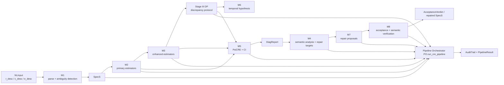

# CRE_v4 与当前项目结构差异对比

Updated: 2026-04-10

## 1. 对比对象与方法

本文比较两个对象：

- 当前仓库实际结构，重点观察仓库根目录与 `isaac-training/training/`
- `doc/CRE_v4.pdf`

本次比对使用的最新文档是：

- `doc/CRE_v4.pdf`
- PDF 元数据创建时间：`2026-04-10 15:38:33 CST`
- 文档版本页标注：`Version 1.0 | April 10, 2026`

对比方法如下：

1. 提取 `CRE_v4.pdf` Part II 的 `Module Registry and Pipeline Topology`、`Core Data Schemas`、`Pipeline Orchestrator`、`Integration Test Suite`
2. 对照仓库中的 `doc/roadmap.md`、`doc/system_architecture_and _control_flow.md`、`doc/verification_readme.md`、`doc/file_structure.md`
3. 再对真实代码树和关键模块做核对，而不是只看现有文档
4. 按四个维度判断差异：
   - 控制流拓扑
   - 模块切分方式
   - 数据与证据契约
   - 产物命名空间与发布边界

状态判断规则：

- `已对齐`：仓库已有明确对应实现
- `部分对齐`：仓库有近似实现，但接口或边界与 `CRE_v4` 不一致
- `未对齐`：`CRE_v4` 明确要求，但仓库当前没有对应结构
- `超出 CRE_v4`：仓库已有实现，但 `CRE_v4` 没有把它作为主结构的一部分

## 2. 结论摘要

当前项目已经具备一个可运行的 CRE 工程栈，但它与 `CRE_v4.pdf` 的结构组织方式并不完全相同。

最核心的判断是：

- 当前仓库是一个 `YAML 规格 + 分阶段脚本 + namespaced bundle` 的工程化实现
- `CRE_v4.pdf` 是一个 `8 个模块 + 1 个统一 orchestrator + 强类型记录对象` 的规范化理论/开发双重框架

因此，两者不是“有没有实现”的差异，而是“实现的组织方式和控制方式”的差异。

当前仓库相对 `CRE_v4` 的强项：

- 已经把 `integration / benchmark / release` 扩到主线结构里
- 已经把运行证据组织成 `analysis/*` namespaced bundles
- 已经把 `mock/offline semantic path` 作为默认可验证路径

当前仓库相对 `CRE_v4` 的主要缺口：

- 没有一个真正落地的统一 `PO.run_cre_pipeline`
- 没有共享的 `AuditTrail` 结构
- 没有显式的 `Stage III Discrepancy Protocol + M6`
- 没有 `PsiCRE + ci_95` 这种统一复合评分中心对象
- 没有把整个系统统一到 `NLInput -> SpecS -> DiagReport -> RepairProposal -> AcceptanceVerdict` 这一套强类型主干上

## 3. `bundle-first` 是什么意思

这里说当前仓库更偏 `bundle-first`，意思不是“先写 bundle 文件”，而是：

- 系统把每个阶段的**机器可读产物包**当成主接口
- 阶段之间主要通过**目录 + JSON/YAML/Markdown 产物**衔接
- “某个阶段是否完成”更多是看它是否写出了约定好的 bundle，而不是只看某个 Python 对象是否在内存里传下去了

在当前项目里，一个 bundle 通常表现为：

- `analysis/<mode>/<bundle_name>/`
- 或者 `training/logs/<run_name>/`

bundle 里通常会有：

- `manifest.json`
- `summary.json`
- 主报告文件
- 下游消费文件
- 可读摘要文件

例如：

- `analysis/static/<bundle>/static_report.json`
- `analysis/report/<bundle>/repair_handoff.json`
- `analysis/repair/<bundle>/validation_context_preview.json`
- `analysis/validation/<bundle>/validation_decision.json`

所以 `bundle-first` 的准确含义是：

- **以落盘后的阶段性证据包作为系统主边界**
- 而不是以“单一 orchestrator 里流动的一组强类型对象”作为唯一主边界

这种方式的优点：

- 更容易复查和回放
- 更适合 smoke test、benchmark、release packaging
- 更方便离线验证与跨脚本衔接

这种方式的代价：

- 容易缺少统一的进程内 pipeline state
- 阶段语义可能分散在多个文件中
- 如果没有额外约束，整体结构会比单 orchestrator 更松散

## 4. 结构流程图

### 4.1 当前 project 流程图

```mermaid
flowchart LR
    A["spec/env config<br/>cfg/spec_cfg + cfg/env_cfg"] --> B["Spec IR<br/>analyzers/spec_ir.py"]
    B --> C["Scene/runtime substrate<br/>env_gen.py + scene_family_bridge.py"]
    C --> D["Execution modes<br/>manual / baseline / eval / train"]
    D --> E["Runtime evidence<br/>training/logs/<run>/"]
    B --> F["Static audit<br/>analysis/static/<bundle>/"]
    E --> G["Dynamic audit<br/>analysis/dynamic/<bundle>/"]
    F --> H["Semantic audit<br/>analysis/semantic/<bundle>/"]
    G --> H
    F --> I["Unified report<br/>analysis/report/<bundle>/"]
    G --> I
    H --> I
    I --> J["Repair generation<br/>analysis/repair/<bundle>/"]
    J --> K["Validation / rerun<br/>analysis/validation/<bundle>/"]
    K --> L["Integration proof<br/>analysis/integration/<bundle>/"]
    L --> M["Benchmark suite<br/>analysis/benchmark/<bundle>/"]
    M --> N["Release packaging<br/>analysis/release/<bundle>/"]
```

当前流程的结构特点：

- 主入口是 YAML 规格与 scene-family 配置
- 各阶段通过 namespaced bundle 连接
- `integration / benchmark / release` 是主线的一部分

### 4.2 `CRE_v4.pdf` 流程图

`CRE_v4` 流程的结构特点：

- 主入口是假定可能来自自然语言的 `NLInput`
- 所有模块由统一 orchestrator 收口
- `SpecS / DiagReport / RepairProposal / AcceptanceVerdict` 是核心中间态
- `AuditTrail` 是全流程公共记录结构

## 5. 顶层结构对比

### 5.1 `CRE_v4` 的结构重心

`CRE_v4.pdf` 的重心是一个统一流水线：

`M1 -> M2 -> M3 -> Stage III DP(M6) -> M5 -> M4 -> M7 -> M8 -> PO`

它更像一个“单系统规范”：

- 入口是自然语言规格 `NLInput`
- 中间核心对象是 `SpecS` 与 `DiagReport`
- 所有模块通过统一 typed schema 交换数据
- 最终由 `Pipeline Orchestrator` 统一编排

### 5.2 当前仓库的结构重心

当前仓库的主线更接近：

`YAML spec/env cfg -> spec_ir -> static/dynamic/semantic scripts -> report -> repair -> validation -> integration -> benchmark -> release`

它更像一个“工程工作区”：

- 入口主要是 `cfg/spec_cfg/*.yaml` 与 `cfg/env_cfg/*.yaml`
- 各阶段通过 `run_*_audit.py` 和 bundle 文件衔接
- 结果以 `analysis/<mode>/<bundle>/` 命名空间产物为中心
- 除主线外，还保留了 `ROS1/ROS2`、`dashboard`、兼容脚本、第三方仿真栈

### 5.3 顶层判断

| 维度 | `CRE_v4.pdf` | 当前仓库 | 判断 |
| --- | --- | --- | --- |
| 主入口 | `NLInput` | YAML 配置与脚本参数 | 部分对齐 |
| 主控制流 | 单 orchestrator | 多脚本分阶段编排 | 部分对齐 |
| 核心交换对象 | dataclass records | JSON/YAML bundles + Python dict/dataclass 混合 | 部分对齐 |
| 发布边界 | 以 CRE pipeline 为中心 | CRE pipeline + benchmark/release + ROS/deployment 兼容层 | 超出 `CRE_v4` |

## 6. 模块结构映射

| `CRE_v4` 模块/结构 | `CRE_v4` 定义 | 当前仓库对应 | 判断 | 说明 |
| --- | --- | --- | --- | --- |
| `M1` | 自然语言解析与歧义检测 | `analyzers/spec_ir.py` 读取 YAML spec；无 NL parser | 部分对齐 | 当前仓库把规格输入前移为机器可读 YAML，而不是把 NL 解析作为第一阶段 |
| `M2` | Primary estimators | `analyzers/static_checks.py`、`analyzers/dynamic_analyzer.py`、`analyzers/dynamic_metrics.py` | 部分对齐 | 仓库按静态/动态分析拆开实现，不是按 `phi_*` 模块集合组织 |
| `M3` | Enhanced estimators | 仓库无明确独立 `M3` 包；部分能力散落在动态/语义分析 | 未对齐 | 没有显式的 enhanced-estimator stage |
| `Stage III + M6` | discrepancy protocol + temporal hypothesis | 无显式独立模块 | 未对齐 | 仓库未实现独立 `Case A/Case B` 差异协议和 `LLM-gamma` |
| `M5` | `PsiCRE` 复合评分与置信区间 | `report_generator.py`、`report_merge.py` 做报告聚合 | 部分对齐 | 有聚合，但没有统一 `psi_cre / ci_95` 中心对象 |
| `M4` | 语义分析与 repair target ranking | `semantic_analyzer.py`、`semantic_merge.py`、`semantic_provider.py` | 部分对齐 | 有语义层，但当前更强调 evidence-grounded claims，而不是 `CRE_v4` 的单模块语义中心 |
| `M7` | repair generation & ranking | `repair/rule_based_repair.py`、`proposal_schema.py` | 部分对齐 | 规则式 repair 已有；`llm_repair_proposer.py` 仍是 placeholder |
| `M8` | acceptance & semantic consistency verification | `repair/acceptance.py`、`repair/validation_runner.py` | 部分对齐 | 有 acceptance/validation，但判定对象与 `CRE_v4` 的 `AcceptanceVerdict` 结构不同 |
| `PO` | top-level orchestrator | `orchestrator/pipeline.py` 仍是 placeholder；实际靠 `run_*` 脚本推进 | 未对齐 | 这是当前与 `CRE_v4` 最大的结构差异之一 |
| Error Code Registry | 全局错误码注册 | 未发现等价统一注册表 | 未对齐 | 当前更多是局部校验与返回结构 |
| Integration Test Suite | 统一模块/集成测试规范 | `unit_test/test_env/*.py` 与 smoke scripts | 部分对齐 | 测试已不少，但不是按 `CRE_v4` 的模块契约表述组织 |

## 7. 数据与证据结构差异

### 7.1 `CRE_v4` 的数据主干

`CRE_v4.pdf` 明确定义了一组中心对象：

- `NLInput`
- `Constraint`
- `RewardDAG`
- `SpecS`
- `AmbiguityFlag`
- `DiagReport`
- `RepairProposal`
- `AcceptanceVerdict`

这些对象共同构成“模块之间如何传递状态”的主干。

### 7.2 当前仓库的数据主干

当前仓库的数据主干更偏“文件契约”而不是“进程内单对象契约”：

- 规格输入：`cfg/spec_cfg/*.yaml`、`cfg/env_cfg/*.yaml`
- 规格 IR：`analyzers/spec_ir.py`
- 运行证据：`training/logs/<run>/manifest.json`、`steps.jsonl`、`episodes.jsonl`、`summary.json`
- 分析产物：`analysis/static|dynamic|semantic|report|repair|validation|integration|benchmark|release/<bundle>/...`
- 契约声明：`analyzers/report_contract.py`、`policy_spec_v0.yaml`

### 7.3 核心差异

| 维度 | `CRE_v4.pdf` | 当前仓库 | 影响 |
| --- | --- | --- | --- |
| 规格输入 | `NLInput` | YAML spec/config | 当前仓库更工程化，但弱化了“从自然语言到结构化规格”的第一阶段 |
| 规格对象 | 单一不可变 `SpecS` | `SpecIR + 多 YAML 文件 + dict` | 可维护性尚可，但难以形成单一 pipeline state |
| 诊断对象 | 统一 `DiagReport` | static/dynamic/semantic/report 多份 bundle | 更利于落盘审计，但统一评分中心较弱 |
| 修复对象 | `RepairProposal` | `repair_candidates.json` + `spec_patch.json` + plan/summary | 文件化更强，但语义层闭环较弱 |
| 验收对象 | `AcceptanceVerdict` | `acceptance.json`、`validation_decision.json`、比较结果 | 结果更细，但缺少一个统一 verdict 类型 |
| 审计追踪 | `AuditTrail` | 主要靠 bundle manifest、summary 和脚本输出 | 当前可追溯，但不是统一追加式 audit trail |

## 8. 方法路径对比

### 8.1 `CRE_v4` 的方法路径

`CRE_v4` 的方法主张是：

1. 从自然语言规格解析出标准化 `SpecS`
2. 先做 primary / enhanced estimator
3. 通过 discrepancy protocol 识别潜在不一致与 critic 质量问题
4. 计算统一复合分数 `PsiCRE`
5. 再用 LLM 做语义诊断、修复生成、语义一致性验证
6. 最后由 orchestrator 做全流程编排和错误治理

### 8.2 当前仓库的方法路径

当前仓库的方法主张是：

1. 先把规格前置成 YAML 和场景 family 配置
2. 再由 `spec_ir` 把配置读成机器可检验对象
3. 通过静态、动态、语义三个并列阶段分别生成证据 bundle
4. 由报告层汇总 findings 和 repair handoff
5. 以规则式 repair 和受限 rerun validation 为主闭环
6. 在主闭环之外继续扩展 `integration / benchmark / release`

### 8.3 方法层面的关键差异

| 主题 | `CRE_v4.pdf` | 当前仓库 |
| --- | --- | --- |
| 入口假设 | 假设输入可能是自然语言，先做解析 | 假设输入应尽早机器可读化 |
| 核心中间态 | 强调单一 pipeline state | 强调跨阶段文件证据与 bundle 契约 |
| LLM 角色 | `M1/M4/M6/M7/M8` 明确深度嵌入 | 当前主要集中在 semantic；repair LLM 仍未落地 |
| 数值中心 | `phi_*`、`kappa/gamma/delta`、`PsiCRE` | `W_CR/W_EC/W_ER`、findings、bundle summary |
| 流程收口 | 统一 orchestrator | 多 CLI 脚本 + smoke path |
| 发布导向 | 到 acceptance/test 为止 | 继续向 benchmark/release 包装延伸 |

## 9. 以强化学习训练为主线看 CRE 的介入方式

如果把“强化学习训练”当作系统主线，那么更容易看清一个关键问题：

- CRE 不是替代 RL 训练
- CRE 是在 **训练前、训练中、训练后、修复回环** 的多个位置对 RL 主线进行约束、观测、诊断和反馈

下面分别说明当前 project 和 `CRE_v4` 是怎么沿着 RL 训练主线介入的。

### 9.1 当前 project 中 CRE 如何介入 RL 训练主线

当前 project 的 RL 主线大致可以写成：

`scene/spec config -> env/train/eval execution -> runtime logs -> analysis bundles -> report -> repair -> validation -> 再回到 execution`

如果按训练时序展开，可以分成四段。

#### A. 训练前介入

在当前 project 里，CRE 首先不是从自然语言进入，而是从机器可读规格进入：

- `cfg/spec_cfg/*.yaml`
- `cfg/env_cfg/*.yaml`
- `analyzers/spec_ir.py`
- `scripts/run_static_audit.py`

这一段 CRE 的作用是：

- 在训练开始前把 `C/R/E` 约束成可检查对象
- 确认 scene family 是否满足预期
- 用 static audit 提前发现 reward/constraint/environment 的结构性问题

也就是说，当前项目里的 CRE 在训练前的角色偏“**训练前审计器**”。

#### B. 训练中介入

当前项目的训练主入口仍然是 RL 脚本：

- `scripts/train.py`
- `scripts/eval.py`
- `scripts/env.py`

CRE 在训练中的主要介入方式不是改写 PPO 本身，而是：

- 把 scene-family backend 接进训练/评估路径
- 把训练过程转成统一的 CRE 运行日志
- 给训练 rollout、周期性 eval rollout、baseline rollout 都打上统一 metadata

这意味着当前 project 里，CRE 在训练中的角色更像：

- **训练运行的观测与证据采集层**
- 而不是训练算法内部的直接控制器

换句话说，当前设计更强调：

- 让训练继续按 RL 主线跑
- 但训练产生的每条执行路径都要变成可分析证据

#### C. 训练后介入

训练或评估结束后，CRE 的主线开始变强：

- `analysis/static`
- `analysis/dynamic`
- `analysis/semantic`
- `analysis/report`

这一段的作用是：

- 把训练产物从“模型表现”转成“CRE 证据”
- 不只问 reward 高不高
- 而是问：
  - 有没有 `C-R` 冲突
  - 有没有 `E-C` 覆盖缺口
  - 有没有 `E-R` 迁移脆弱性

所以当前 project 的 CRE 在训练后的角色是：

- **训练结果解释器**
- **失配定位器**
- **repair handoff 生成器**

#### D. 修复回环中的介入

当前 project 在训练主线之后还接上了 repair/validation 回环：

- `analysis/repair`
- `analysis/validation`
- bounded rerun / native rerun

这一步的逻辑是：

1. 根据 report 形成 repair candidate
2. 对 spec/env/reward 做最小修补
3. 用 rerun 或受限真实执行重新拿证据
4. 再判断修复是否改善了训练相关问题

因此，当前 project 里 CRE 对 RL 的完整介入方式可以总结为：

- **训练前：先审计规格**
- **训练中：采集统一证据**
- **训练后：做结构化诊断**
- **训练后回环：推动修复并验证**

它更像一个围绕 RL 训练主线包裹起来的“**证据型外环系统**”。

### 9.2 `CRE_v4` 中 CRE 如何介入 RL 训练主线

`CRE_v4` 的思路也围绕 RL 训练，但它的介入更内聚、更强类型化。

如果按训练主线理解，`CRE_v4` 的逻辑更接近：

`NL spec -> SpecS -> pre-training estimators -> discrepancy/composite diagnosis -> semantic reasoning -> repair proposal -> acceptance -> repaired SpecS -> 再进入训练/验证`

同样按时序拆开看：

#### A. 训练前介入更早

`CRE_v4` 的入口是：

- `NLInput`
- `M1`
- `SpecS`

这意味着它在“训练之前”的介入比当前 project 更早一步：

- 不仅检查训练要用的 machine-readable config
- 还要先把自然语言目标、奖励、约束、环境描述解析成正式规格

所以 `CRE_v4` 在训练前的角色是：

- **规格构造器**
- **规格消歧器**
- **训练前一致性分析器**

#### B. 对训练前诊断的建模更强

在 `CRE_v4` 里，训练前不是简单 static check，而是：

- `M2` primary estimators
- `M3` enhanced estimators
- Stage III discrepancy protocol
- `M5` composite scoring

这说明 `CRE_v4` 试图在真正进入训练或大规模运行前，就先形成：

- reporter
- discrepancy signal
- `PsiCRE`
- 不确定性区间

因此它把 CRE 对 RL 主线的介入前推到了：

- **训练前诊断层**
- 而且是一个比当前项目更统一、更模型化的训练前诊断层

#### C. 训练后语义诊断和修复提议更嵌入主流程

在 `CRE_v4` 中：

- `M4` 负责 semantic analysis + repair-target ranking
- `M7` 负责 repair proposal generation
- `M8` 负责 acceptance and semantic verification

这表示训练后阶段不是“若干外部脚本消费 bundle”，而是：

- 同一个 pipeline state 持续流经语义诊断、修复生成、验收判断

所以 `CRE_v4` 在训练后的角色更像：

- **训练诊断内核**
- **修复决策内核**

#### D. 修复后返回训练主线的路径更规范化

`CRE_v4` 里 repair 的目标是得到：

- repaired `SpecS`
- `AcceptanceVerdict`

然后再把修复后的规格送回下一轮训练/验证。

因此它对 RL 主线的介入是一个更规范的：

- `spec -> diagnose -> repair -> accept/reject -> retrain/revalidate`

闭环。

从这个角度看，`CRE_v4` 更像围绕 RL 训练主线构建出的“**统一内核型中枢系统**”。

### 9.3 两者在 RL 训练主线上的差异总结

| 观察角度 | 当前 project | `CRE_v4` |
| --- | --- | --- |
| CRE 从哪里开始介入训练主线 | 从 YAML spec/env config 和静态审计开始 | 从自然语言规格解析和 `SpecS` 构造开始 |
| 训练前介入重点 | 规则化、可落盘、可执行的 preflight audit | 统一 reporter、discrepancy、`PsiCRE` 的训练前诊断 |
| 训练中介入重点 | 日志标准化、scene-family 绑定、运行证据采集 | 文档结构里更强调前后诊断，训练中细节不如当前 repo 工程化 |
| 训练后介入重点 | bundle-based static/dynamic/semantic/report 流 | 单 pipeline state 上的模块化诊断与修复 |
| repair 如何回到 RL 主线 | 通过 repair bundle 和 validation rerun 回流 | 通过 repaired `SpecS` 和 `AcceptanceVerdict` 回流 |
| 整体形态 | 围绕 RL 的证据型外环系统 | 围绕 RL 的统一内核型中枢系统 |

### 9.4 一个更直观的判断

如果只从“强化学习训练是不是主线”这个问题看：

- 两者都把 RL 训练当主线
- 区别不在于谁围绕 RL，谁不围绕 RL
- 而在于 CRE 是以什么方式围绕 RL

当前 project 更像：

- **训练主线在中间跑**
- CRE 在两侧做审计、证据化、诊断、修复和验证

`CRE_v4` 更像：

- **CRE 本身就是训练主线的上层控制内核**
- 训练是这个内核所驱动和反复调用的执行环节之一

## 10. 当前 project 在没有 CRE 介入时的 RL 训练启动主流程

如果暂时把下面这些内容都从主线里拿掉：

- CRE runtime logging
- static/dynamic/semantic/report/repair/validation
- bundle 命名空间
- acceptance 检查
- repair rerun 回环

那么当前 project 的强化学习训练启动主流程，实际上仍然是一条比较标准的：

`配置加载 -> 启动 Isaac Sim -> 创建环境 -> 创建控制器包装 -> 创建 PPO 策略 -> collector 收集数据 -> PPO 更新 -> 周期性评估 -> 保存 checkpoint`

这一节只描述这条“**不带 CRE 外环**”的纯 RL 主链。

### 10.1 启动主流程概览

从入口脚本看，训练启动主线是：

1. 读取 Hydra 配置
2. 启动 `SimulationApp`
3. 初始化 WandB run
4. 构造 `NavigationEnv`
5. 用 `LeePositionController + VelController` 包装环境
6. 构造 `PPO` 策略
7. 用 `SyncDataCollector` 开始采样 rollout
8. 在主循环里反复：
   - 收集一批数据
   - 调用 `policy.train(data)` 更新网络
   - 累积 episode 统计
   - 按周期调用 `evaluate(...)`
   - 按周期保存 checkpoint
9. 训练结束后保存最终模型并退出

如果忽略 CRE 部分，`train.py` 的主职责就是把这 9 步串起来。

### 10.2 纯 RL 视角下的启动链条

#### A. 配置装配

训练入口首先由 Hydra 组装配置：

- `cfg/train.yaml`
- `cfg/ppo.yaml`
- `cfg/sim.yaml`
- `cfg/drone.yaml`

其中：

- `train.yaml` 决定训练长度、环境规模、WandB、默认 scene/runtime 参数
- `ppo.yaml` 决定 PPO 超参数
- `sim.yaml` 决定 Isaac Sim/PhysX 仿真参数
- `drone.yaml` 决定无人机模型相关参数

在“无 CRE 介入”的视角下，这一层可以理解成：

- **训练启动所需的基础实验配置层**

#### B. 仿真器和实验 run 启动

然后 `scripts/train.py` 做两件最上游的事情：

- 启动 `SimulationApp`
- 初始化 WandB run

这一步的功能是：

- 给 RL 训练准备仿真运行时
- 给训练过程准备实验记录器

如果没有 CRE，这里依然成立，因为这是 RL 训练最基础的外部运行壳。

#### C. 环境构造

随后训练脚本构造：

- `scripts/env.py` 中的 `NavigationEnv`

这是纯 RL 主流程里的核心一层。

从职责上看，`NavigationEnv` 负责：

- 设计和生成场景
- 挂载无人机、障碍物、传感器
- 定义 observation space
- 定义 action space
- 定义 reward
- 定义 done / termination

从代码结构上看，环境主干包括这些关键方法：

- `_design_scene`
- `_set_specs`
- `_reset_idx`
- `_pre_sim_step`
- `_post_sim_step`
- `_compute_state_and_obs`
- `_compute_reward_and_done`

如果不考虑 CRE，这一层就是：

- **标准 RL 任务环境定义层**

#### D. 控制器包装

环境创建后，训练脚本不会直接让策略输出电机级动作，而是先加一个控制器包装：

- `LeePositionController`
- `VelController`
- `TransformedEnv`

这一步的作用是：

- 让策略输出速度指令
- 再由低层控制器把速度指令转成无人机可执行控制

所以在纯 RL 主链里，这一层是：

- **动作语义到真实执行控制的桥接层**

#### E. 策略与优化器构造

接着训练脚本构造：

- `scripts/ppo.py` 中的 `PPO`

这里面包含：

- feature extractor
- actor
- critic
- value norm
- GAE
- Adam optimizers

从训练主线看，这一层是：

- **策略学习内核**

也就是纯 RL 主流程里真正负责“学”的部分。

#### F. 数据采样

然后训练脚本构造：

- `SyncDataCollector`

collector 的职责是：

- 驱动策略和环境交互
- 收集一批 rollout 数据
- 返回包含 observation/action/reward/next/done 的 `TensorDict`

如果没有 CRE，这一步仍然是 RL 主流程的中心数据入口：

- **经验采样层**

#### G. 参数更新

主循环里最关键的一步是：

- `policy.train(data)`

也就是 `scripts/ppo.py` 里的 PPO 更新逻辑。

从算法过程看，它做的事情包括：

- 计算 next state value
- 计算 GAE advantage 和 return
- 做 advantage normalization
- 多 epoch / minibatch 更新 actor、critic、feature extractor

所以纯 RL 主链真正的训练闭环是：

`collector rollout -> PPO update -> next rollout -> next PPO update`

#### H. 周期性评估

训练过程中，`scripts/train.py` 还会按 `eval_interval` 周期性调用：

- `scripts/utils.py` 中的 `evaluate(...)`

评估路径的作用是：

- 切到 eval 模式
- 用确定性策略跑一轮评估
- 统计回报、成功率、碰撞等指标
- 恢复训练模式

如果没有 CRE，这一层依然是：

- **训练过程中的策略质量回看层**

#### I. checkpoint 保存与训练结束

最后训练脚本会：

- 按 `save_interval` 保存 checkpoint
- 训练结束保存 `checkpoint_final.pt`
- 关闭 WandB
- 关闭仿真器

所以纯 RL 主流程最终收口到：

- 模型权重
- WandB 训练曲线
- 评估统计

### 10.3 涉及哪些文件

如果只看“没有 CRE 介入时”的训练启动主流程，核心文件可以按职责分成下面几组。

#### A. 启动与配置

- `isaac-training/training/scripts/train.py`
- `isaac-training/training/cfg/train.yaml`
- `isaac-training/training/cfg/ppo.yaml`
- `isaac-training/training/cfg/sim.yaml`
- `isaac-training/training/cfg/drone.yaml`

#### B. 环境与仿真任务定义

- `isaac-training/training/scripts/env.py`
- `isaac-training/training/envs/env_gen.py`

说明：

- 从“去掉 CRE 外环”的角度看，`env.py` 仍然是环境主定义
- `env_gen.py` 仍然是场景/障碍物生成的底层支撑

#### C. 策略学习内核

- `isaac-training/training/scripts/ppo.py`
- `isaac-training/training/scripts/utils.py`

说明：

- `ppo.py` 负责 actor/critic/GAE/PPO update
- `utils.py` 提供评估函数、优势估计和若干训练工具

#### D. 第三方运行时依赖

- `isaac-training/third_party/OmniDrones/...`
- Isaac Sim / TorchRL / PyTorch 相关依赖

这些文件不是项目自己定义的训练主逻辑，但它们是主流程能跑起来的基础依赖。

### 10.4 一句话总结

如果不引入 CRE，当前 project 的 RL 训练启动主流程本质上就是：

- `train.py` 读取配置并启动 Isaac Sim
- `env.py` 构造导航环境
- `ppo.py` 定义并训练策略
- `utils.py` 负责评估与训练辅助
- 配置文件决定仿真、环境和算法超参数

也就是说，它首先仍然是一个**标准的 Isaac Sim + PPO 导航训练栈**；
CRE 是后来叠加在这条主链外侧和上下游的分析、证据与修复系统。

## 11. 当前仓库相对 `CRE_v4` 的“多出来的结构”

这些结构不是问题，但它们说明当前仓库比 `CRE_v4` 的 Part II 范围更宽：

- `pipeline/benchmark_suite.py`
- `pipeline/release_bundle.py`
- `scripts/run_benchmark_suite.py`
- `scripts/run_release_packaging.py`
- `dashboard/`
- `ros1/` 与 `ros2/`
- 各类 smoke scripts 与兼容入口

换句话说，当前仓库不是单纯“没跟上 `CRE_v4`”，而是已经在某些方向上走得比 `CRE_v4` 的开发手册更远，尤其是：

- 工程化 bundle 打包
- benchmark case 编排
- release artifact 输出
- 离线/无 API key 默认可验证路径

## 12. 差异归因

当前差异主要来自四类原因：

1. **输入形式不同**
   - `CRE_v4` 允许从自然语言开始
   - 当前仓库已经把很多规范前置为 YAML

2. **实现策略不同**
   - `CRE_v4` 用一个统一 orchestrator 管模块
   - 当前仓库用分阶段 CLI 和 namespaced bundle 管模块

3. **验证目标不同**
   - `CRE_v4` 更偏“论文方法 + agent handbook”
   - 当前仓库更偏“仓库内可复现、可打包、可 smoke-test”

4. **边界范围不同**
   - `CRE_v4` 聚焦 CRE pipeline 本体
   - 当前仓库还保留 RL、仿真、ROS、dashboard、兼容层

## 13. 对齐建议

如果后续目标是让仓库结构更贴近 `CRE_v4.pdf`，建议按下面顺序推进，而不是推翻现有工程骨架：

1. **先补统一 orchestrator**
   - 让 `orchestrator/pipeline.py` 真正落地
   - 由它串联现有 `run_*` 与 bundle writer

2. **再补统一 pipeline state**
   - 在不替换现有 bundle 的前提下，引入与 `SpecS / DiagReport / RepairProposal / AcceptanceVerdict` 对应的仓库内 dataclass
   - 让 bundle 成为这些对象的落盘形式，而不是唯一主干

3. **补 `Stage III + M6`**
   - 把 discrepancy protocol 从报告阶段拆出来
   - 明确 latent inconsistency 与 temporal hypothesis 的触发逻辑

4. **决定 `M1` 的定位**
   - 如果项目继续以 YAML 为主，则应明确“YAML-first 是对 `CRE_v4` 的工程化收敛”
   - 如果要对齐论文框架，就需要补 NL parser 和 ambiguity handling

5. **决定是否引入统一 `PsiCRE`**
   - 如果保留当前 finding-first/report-first 路线，可以把 `PsiCRE` 作为派生指标
   - 不建议为了对齐文档而牺牲现有 bundle 契约

## 14. 最终判断

截至 `2026-04-10`，当前项目与 `doc/CRE_v4.pdf` 的关系可以概括为：

- **理念主线基本一致**
  - 都围绕 `spec -> execution -> evidence -> analysis -> repair -> validation`

- **结构组织方式明显不同**
  - `CRE_v4` 更统一、更强类型、更单入口
  - 当前仓库更工程化、更文件契约化、更强调 bundle/replay/release

- **当前仓库并非落后于 `CRE_v4`**
  - 它是在部分核心结构未完全对齐的前提下，已经向 benchmark/release 工程化延伸

因此，后续更合理的方向不是“按 `CRE_v4` 推倒重写”，而是：

- 保留当前 `bundle-first` 的工程优势
- 有选择地吸收 `CRE_v4` 中最关键的统一结构：
  - orchestrator
  - audit trail
  - discrepancy protocol
  - unified typed pipeline state

## 15. `CRE_v4.pdf` 与两个 HTML 架构图的对应判断（2026-04-11 补充）

本节直接回答三个问题：

1. `doc/CRE_v4.pdf` 更像哪个 HTML？
2. 当前 project 已实现内容更像哪个 HTML？
3. `doc/cre_frame_new.html` 与 `doc/structure-preview-en.html` 的核心差异是什么？

### 15.1 直接结论

- **`CRE_v4.pdf` 的代码架构更接近 `doc/cre_frame_new.html`**。
- **当前 project 已实现内容，整体上更接近 `doc/structure-preview-en.html` 的工程组织形态**，但实现深度并未完全覆盖该图里“LLM 深度主导联合修复”的全部设定。

### 15.2 为什么说 `CRE_v4.pdf` 更像 `cre_frame_new.html`

`cre_frame_new.html` 与 `CRE_v4.pdf` 在以下结构点上高度同构：

- 都是**分阶段主干流水线**（从规格输入到验收闭环）。
- 都强调 **Primary / Enhanced estimator 拆分**。
- 都有 **Discrepancy Protocol（矛盾协议）** 作为条件触发层。
- 都强调 **canonical reporters 才进入 Ψ_CRE 数值聚合**，增强估计器主要影响不确定性标签。
- 都保留多角色 LLM 的阶段分工（解析、语义分析、修复、语义一致性校验）。

换句话说，`cre_frame_new.html` 更像是把 `CRE_v4` 的方法学骨架可视化成一个“规范导向的阶段化 pipeline”。

### 15.3 为什么说当前 project 更像 `structure-preview-en.html`

当前项目在仓库内的主组织方式，已经更偏：

- **IR + 多分析器并行**（static/dynamic/semantic）
- **检测引擎汇聚**（报告层聚合）
- **repair/validation/integration/benchmark/release** 的工程化后处理链路
- 以 **bundle/manifest/summary** 作为阶段接口

这种组织方式与 `structure-preview-en.html` 的“IR 层 + 三分析器 + 检测引擎 + repair engine + validation loop + 训练/反馈闭环”更相像。

### 15.4 两个 HTML 架构图的差异（核心维度）

| 维度 | `doc/cre_frame_new.html` | `doc/structure-preview-en.html` |
| --- | --- | --- |
| 架构定位 | 贴近 `CRE_v4` 的方法规范图 | 贴近工程运行图/系统编排图 |
| 控制流形态 | 以阶段串行为主，含条件触发（如 discrepancy） | IR 驱动的并行分析后汇聚，再进入 repair/validation |
| 指标主轴 | canonical reporter 主导 Ψ_CRE，enhanced 主要进入不确定性 | γ_EC / δ_ER / κ_CR + 扩展 ρ_RR，偏运行监测与决策 |
| LLM 角色 | 分阶段注入（解析、语义、修复、一致性验证） | 更接近“LLM core driver + analyzer/repair 参与者” |
| 修复哲学 | 强调最小编辑与验收条件（accept/reject） | 强调模块化修复（C/R/E/Hybrid）与候选队列、迭代回路 |
| 系统边界 | 重点到诊断-修复-验收闭环 | 明确延伸到训练与持续反馈（更工程化） |

### 15.5 对当前仓库定位的含义

如果用一句话概括：

- `CRE_v4.pdf` 与 `cre_frame_new.html` 更接近“**理论与规范主干**”；
- 当前仓库与 `structure-preview-en.html` 更接近“**工程执行与产物编排主干**”。

因此，当前差距主要不是“有没有做”，而是“是否把现有工程化流水线进一步收敛到 `CRE_v4` 的统一 typed orchestrator 语义中心”。

## 16. 在当前代码框架上迁移到 `CRE_v4` 的改造项与工作量评估（2026-04-11 补充）

本节回答三个问题：

1. 基于当前仓库，要改成 `CRE_v4` 框架需要改什么；
2. 工作量有多大；
3. 是否会改动很多。

### 16.1 结论先行

- **不是推倒重写**，但属于一次**中到大型架构收敛**。
- 如果目标是“语义对齐 + 可运行”，可采用增量改造；
- 如果目标是“严格贴合 `CRE_v4` 模块契约（M1~M8 + PO + AuditTrail）”，改动会明显扩大。

### 16.2 必改项（P0，决定是否算 `CRE_v4` 框架）

1. **落地统一 orchestrator（PO）**
   - 把当前 `run_*_audit.py` 的分段入口，统一收口到一个主入口（例如 `PO.run_cre_pipeline`）。
   - 让 static/dynamic/semantic/report/repair/validation 不再只靠“脚本串接”，而是由统一 pipeline state 驱动。

2. **建立统一 typed pipeline state**
   - 引入并贯通 `NLInput -> SpecS -> DiagReport -> RepairProposal -> AcceptanceVerdict` 对象主干。
   - 现有 bundle 继续保留，但应成为这些对象的落盘镜像，而不是唯一系统边界。

3. **补齐 Stage III Discrepancy Protocol + M6 语义**
   - 当前缺少独立的“primary vs enhanced 信号冲突协议”与 temporal hypothesis 阶段。
   - 需要从报告聚合中拆分出明确触发条件、状态转换和证据记录。

4. **建立统一 `PsiCRE + uncertainty/CI` 中心对象**
   - 当前有聚合报告，但不是统一评分中心类型。
   - 需要把评分计算、区间估计、不确定性标记与报告消费方统一。

5. **补 M1 的输入双通道策略**
   - `CRE_v4` 假定可从自然语言进入；当前是 YAML-first。
   - 工程上可采用“双通道”：`NL -> parser -> SpecS` 与 `YAML -> adapter -> SpecS` 并存。

### 16.3 高价值但可后置项（P1/P2）

1. **LLM repair proposer 从 placeholder 变可运行**
   - 现在 `llm_repair_proposer.py` 仍是占位。
   - 可先用 mock/offline provider 跑通结构，再接真实 provider。

2. **Error code registry 与跨模块错误治理**
   - 当前是局部校验/局部报错。
   - `CRE_v4` 更偏全局错误码体系，可提升可审计性与重试策略一致性。

3. **测试组织从“脚本/阶段”向“模块契约”补齐**
   - 在现有 smoke 测试之外，补 M1~M8 + PO 的契约级测试矩阵。

### 16.4 预计会改哪些地方

按当前仓库结构，主要改动面会集中在：

- `isaac-training/training/orchestrator/`
- `isaac-training/training/analyzers/`
- `isaac-training/training/repair/`
- `isaac-training/training/scripts/`（保留兼容入口并改为调用 PO）
- `isaac-training/training/pipeline/`（与 orchestrator 的职责边界重整）
- `doc/` 中的架构、验证、traceability 文档
- 对应单测与 smoke 测试

相对可控的部分：

- `env.py`、`ppo.py`、场景生成与底层仿真主体通常不需要大改算法逻辑；
- 主要变化在“控制流、对象契约、阶段边界、证据组织”。

### 16.5 工作量估算（按目标强度）

| 目标强度 | 目标定义 | 预估人周 | 预估改动文件量 | 说明 |
| --- | --- | --- | --- | --- |
| L1：最小可对齐 | 有 PO 主入口 + typed state 骨架 + Stage III 基础实现；保留现有 bundle-first 外形 | 3~5 人周 | 20~40 个文件 | 风险最低，最适合先落地 |
| L2：中度对齐 | M1~M8 语义基本落地，`PsiCRE` 中心对象统一，脚本入口主要转为 PO 包装 | 6~10 人周 | 40~80 个文件 | 改动面已明显变大 |
| L3：严格对齐 | 契约、错误码、测试矩阵、文档、发布路径均按 `CRE_v4` 主干重整 | 10~16 人周 | 80~140 个文件 | 属于体系化重构 |

说明：

- 上表按已有代码质量与现有 Phase 10/11 资产可复用前提估计；
- 如果要求同时保障历史 bundle 全兼容，工期会再上浮约 20%~35%。

### 16.6 “会不会改很多”的直接回答

- **会改不少，但主要是“架构层与接口层”改动，不是大规模重写 RL 算法层。**
- 体感上是“中到大改动”：
  - 少量脚本改动会扩散成入口重整；
  - 数据契约统一会触发 report/repair/validation 连锁修改；
  - 但环境动力学与训练器内核通常可保持稳定。

### 16.7 建议的落地顺序（降低风险）

1. **先做 L1**：PO 主入口 + typed state 骨架 + Stage III 最小实现。
2. **再做 L2**：统一 `PsiCRE` 对象与验收判定对象，脚本全面 PO 化。
3. **最后做 L3**：错误码体系、契约测试矩阵、发布面与文档完全收敛。

这样可以在不破坏现有 smoke/benchmark/release 路径的前提下，逐步收敛到 `CRE_v4` 框架。
